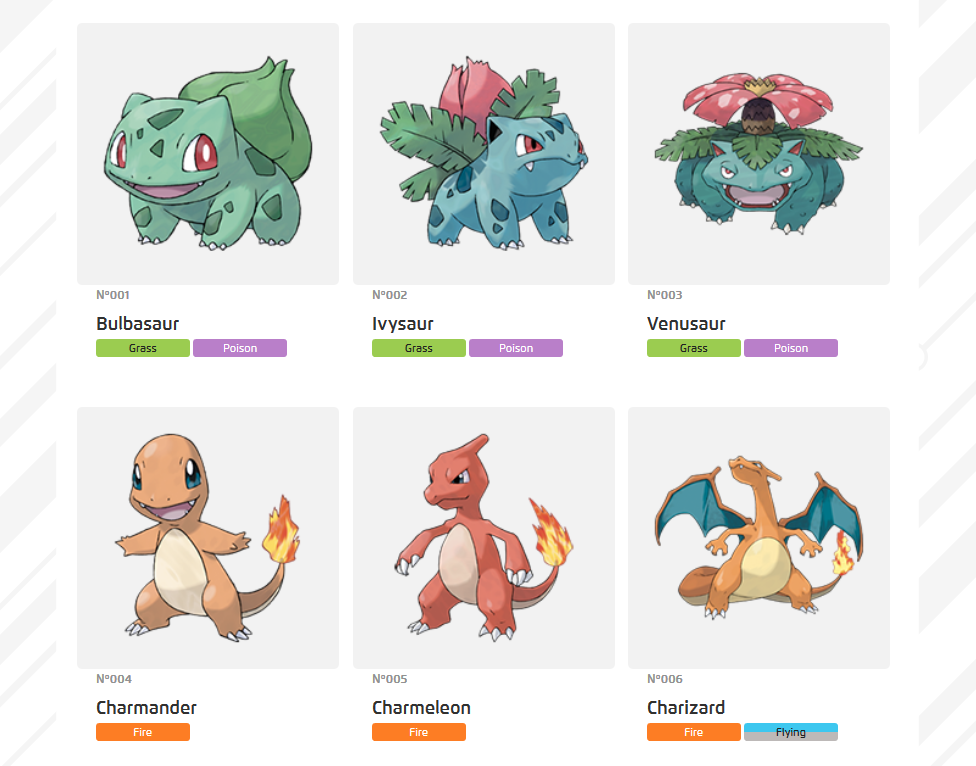
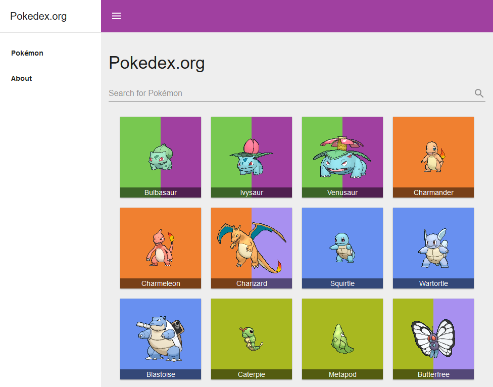

# USUCAMPEÃO Tecnologia em Regularização Imobiliária

Somos mais que uma Startup de regularização de imóveis, nascemos para resolver um problema social que atinge mais de 50% da população brasileira.

Através da inovação, execução de qualidade e baixo custo realizamos o sonho da propriedade regularizada.

Nosso propósito é gerar segurança jurídica e #prosperidade a todas as pessoas.

*Venha fazer parte deste time CAMPEÃO!!!*

## Desenvolvedor Front-End

Então, quer dizer que você gosta de desafios e quer se tornar um desenvolvedor front-end na UsuCampeão? Está no lugar certo!

Este teste faz parte do nosso processo de seleção e é a sua chance de nos mostrar todo o seu conhecimento como desenvolvedor front-end com angular. Este teste está dividido em duas etapas:

1. Responder um questionário sobre HTML, CSS, JavaScript e Angular
1. Desenvolver uma aplicação simples, demonstrando seu conhecimento na prática

Daremos um feedback a todos os que fizerem o Pull Request.

O questionário e a especificação da aplicação estão logo abaixo.

A sua entrega será feita através de um Pull Request nesse repositório. Faça um fork do repositório, implemente o seu código, responda as questões no README.md e faça um pull request. Sinta-se a vontade para colocar quaisquer outras informações que você considere pertinente no README.

### Instruções:

1. Faça um fork deste repositório;
1. Responda as questões no README.md - caso prefira, podemos conversar sobre elas na entrevista;
1. Construa uma aplicação conforme solicitado, utilizando HTML, CSS e Angular;
1. Adicione quaisquer informações adicionais para executar sua aplicação no README.md;
1. Após terminar, submeta um pull request e aguarde seu feedback.

**PS:** Utilizamos este mesmo testes para os níveis (**júnior**, **pleno** ou **sênior**), apenas adequando o nível de exigência na avaliação de acordo com o perfil da vaga.

### Questionário

1. O que são ``components`` e ``directives`` e quais as difenças entre eles? Dê alguns exemplos de utilização.
2. O que são ``services``? Dê alguns exemplos de utilização.
3. O que são ``pipes``? Dê alguns exemplos de utilização.
4. O que é ``data-binding`` e quais os tipos que o Angular dá suporte?
5. Como se adiciona um *listener* de eventos do usuário em um componente? Por exemplo, como adicionar uma função que responde a um clique de usuário?
6. Quais as diferenças entre ``constructor`` e ``ngOnInit``, e quando devemos usar cada um?
7. Quais as diferenças entre ``Observables`` e ``Promises``? Como você o utilizaria cada um em um ``template``?
8. Quais as diferenças entre ``template-driven forms`` e ``reactive forms``? Como fazer validação de dados de formulário em cada caso?
9.  Como se utiliza o ``angular router``? Quais são as formas de enviar parâmetros para uma rota?
10.  O que são *guards de rota* e para que são úteis?
11. O que é ``NgZone``? Em que momento deve ser utilizada?
12. O que é *injeção de dependências* e por que isso é útil? Como você realiza injeção de dependências entre módulos?

Ah, e a mais importante de todas: Bulbassauro, Charmander ou Squirtle? =)

### Projeto: Criando uma Pokédex usando a PokéAPI

A [PokéAPI](https://pokeapi.co/) é uma API aberta, sem necessidade de  disponibiliza uma API REST com, entre outras coisas, informações de todos os Pokémons até a geração 7. Seu objetivo, neste projeto, é criar uma Pokédex em Angular usando a PokéAPI.

Você é livre para montar a aplicação como quiser, mas gostaríamos de ver a listagem de todos o Pokémons, com informações básicas, em uma página inicial e detalhes do Pokémon selecionado em outra página. Como referência de layout, recomendamos que utilize as seguintes Pokédex como exemplo:
- [Pokédex oficial](https://www.pokemon.com/br/pokedex/)

- [Pokedex.org](https://pokedex.org/)

Temos alguns pré-requisitos:
- Utilização de Angular 8+;
- Uso de SASS/SCSS para CSS da aplicação;
- Design responsivo;
- Ah, e não se esqueça de mostrar os sprites (as imagens) de cada Pokémon!

Além disso, vamos avaliar como você organiza e documenta o projeto, e a estrutura de módulos, componentes, serviços e rotas que você criou.

Ganhe pontos extras por:
- Uso de Angular Material;
- Layout diferenciado e animações;
- Mecanismo de pesquisa;
- Cache e persistência dos dados no ``localStorage`` ou ``IndexedDB``;
- Funcionamento offline com os dados cacheados - melhor ainda se for um PWA!;
- Testes unitários e end to end;
- Scripts de deploy;
- Organização e mensagens dos commits.

**Boa sorte! =)**